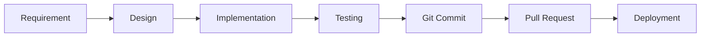

# Development Processes

## Development Workflow

### 1. Feature Development Process


**Steps**:
1. **Requirement Analysis**: Understand user needs and constraints
2. **Design Phase**: Plan architecture and data flow
3. **Implementation**: Write code following project standards
4. **Testing**: Test with real Yahoo Finance data
5. **Git Commit**: Immediate commit after code changes
6. **Pull Request**: Create/update PR to main branch
7. **Deployment**: Currently local only (port 8002)

### 2. Git Workflow

#### Branch Strategy
- **main**: Protected production branch
- **genspark_ai_developer**: AI development branch
- **backup-YYYY-MM-DD-HHMM**: Timestamped backup branches

#### Commit Process
```bash
# 1. Make changes
edit files...

# 2. Immediately commit (MANDATORY)
git add .
git commit -m "feat(module): descriptive message"

# 3. Sync with remote
git fetch origin main
git rebase origin main

# 4. Resolve conflicts if any (prefer remote changes)
git status
# edit conflicted files
git add resolved_files
git rebase --continue

# 5. Push to feature branch
git push origin genspark_ai_developer

# 6. Create/Update Pull Request
# Via GitHub UI or CLI
```

### 3. Testing Process

#### Local Testing Checklist
- [ ] Backend server running on port 8002
- [ ] Test with real ASX symbols (CBA.AX, BHP.AX)
- [ ] Verify percentage calculations
- [ ] Check AEST time display
- [ ] Test all period selections
- [ ] Verify chart updates every 30 seconds
- [ ] Check error handling for invalid symbols

#### Windows Compatibility Testing
- [ ] Use hardcoded `http://localhost:8002` URLs
- [ ] Test in Chrome, Edge, Firefox
- [ ] Verify no CORS errors
- [ ] Check console for JavaScript errors

### 4. Debugging Process

#### Backend Debugging
```python
# Add logging to backend_fixed.py
import logging
logging.basicConfig(level=logging.DEBUG)
logger = logging.getLogger(__name__)

# Log critical points
logger.debug(f"Symbol: {symbol}, Data: {data}")
```

#### Frontend Debugging
```javascript
// Add console logging
console.log('Fetch URL:', url);
console.log('Response:', response);
console.log('Processed data:', data);

// Use browser DevTools
// F12 -> Network tab to inspect API calls
// F12 -> Console for JavaScript errors
```

### 5. Data Validation Process

#### Yahoo Finance Data Validation
1. **Symbol Format**: Ensure .AX suffix for ASX stocks
2. **Data Completeness**: Check for null/undefined values
3. **Percentage Calculation**: Verify using previous close
4. **Time Zones**: Convert all times to AEST

#### Response Format Validation
```javascript
// Expected backend response format
{
    symbol: "CBA.AX",
    period: "5d",
    data: [
        {
            time: "2024-10-01T10:00:00",
            open: 145.50,
            high: 146.00,
            low: 145.00,
            close: 145.75,
            volume: 1000000
        }
    ],
    dataPoints: 100
}
```

### 6. Backup and Recovery Process

#### Creating Backups
```bash
# Before major changes
git checkout -b backup-$(date +%Y-%m-%d-%H%M)
git push origin backup-$(date +%Y-%m-%d-%H%M)

# File system backup
cp backend_fixed.py backend_fixed_backup_$(date +%Y%m%d).py
tar -czf modules_backup_$(date +%Y%m%d).tar.gz modules/
```

#### Recovery Process
```bash
# From Git
git log --oneline  # Find good commit
git checkout <commit-hash>  # Restore to that point

# From backup branch
git checkout backup-2024-10-01-1200
git checkout -b recovery
git push origin recovery

# From file backup
cp backend_fixed_backup_20241001.py backend_fixed.py
tar -xzf modules_backup_20241001.tar.gz
```

### 7. Documentation Process

#### Code Documentation Standards
- **Python**: Docstrings for all functions
- **JavaScript**: JSDoc comments for functions
- **HTML**: Comments for major sections
- **README**: Update for significant changes

#### Documentation Updates Required
1. After new feature implementation
2. When changing API endpoints
3. After fixing critical bugs
4. When modifying data structures
5. After reorganizing project structure

### 8. Performance Monitoring

#### Backend Performance
- Monitor API response times
- Check yfinance rate limiting
- Verify cache effectiveness
- Log slow queries

#### Frontend Performance
- Check Chart.js rendering time
- Monitor memory usage in DevTools
- Verify 30-second update efficiency
- Test with multiple charts open

### 9. Error Handling Process

#### Backend Error Handling
```python
try:
    data = yf.Ticker(symbol).history(period=period)
except Exception as e:
    logger.error(f"Yahoo Finance error: {e}")
    return {"error": "Failed to fetch data", "symbol": symbol}
```

#### Frontend Error Handling
```javascript
try {
    const response = await fetch(url);
    if (!response.ok) throw new Error(`HTTP ${response.status}`);
    const data = await response.json();
} catch (error) {
    console.error('Error:', error);
    showErrorMessage('Failed to load data');
}
```

### 10. Release Process

#### Pre-release Checklist
- [ ] All tests passing
- [ ] Documentation updated
- [ ] Git commits up to date
- [ ] Pull request approved
- [ ] Backup created
- [ ] Windows compatibility verified

#### Release Steps
1. Merge PR to main branch
2. Tag release version
3. Create release notes
4. Update PROJECT_OVERVIEW.md
5. Notify stakeholders

## Critical Rules

1. **NO SYNTHETIC DATA** - Always use real Yahoo Finance data
2. **IMMEDIATE COMMITS** - Commit every code change immediately
3. **WINDOWS COMPATIBILITY** - Use hardcoded localhost:8002
4. **BACKUP BEFORE MAJOR CHANGES** - Always create backups
5. **TEST WITH REAL DATA** - Use actual ASX symbols for testing